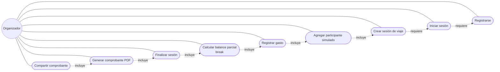

# Diagrama de casos de uso

Actor único: **Organizador** (el único usuario real de la v1; ver sección 2 del prompt maestro).

## Descripción breve de cada caso de uso

| Caso de uso | Requisitos cubiertos | Descripción |
|---|---|---|
| Registrarse | RF01 | El organizador crea su cuenta con email y contraseña (ASP.NET Core Identity). |
| Iniciar sesión | RF02 | El organizador se autentica para acceder a sus sesiones de viaje. |
| Crear sesión de viaje | RF03 | El organizador crea una nueva sesión de viaje con un nombre. |
| Agregar participante simulado | RF04, RF07 | El organizador carga los nombres de las personas que viajan (sin cuenta propia). |
| Registrar gasto | RF05, RF06, RF07 | El organizador carga un gasto (monto, fecha, lugar, motivo, pagador, método de pago), con o sin conexión. |
| Calcular balance parcial (break) | RF08, RF10 | El organizador corta cuentas a mitad de viaje sin cerrar la sesión. |
| Finalizar sesión | RF09, RF10 | El organizador cierra definitivamente la sesión de viaje con el balance final. |
| Generar comprobante PDF | RF13 | El sistema genera un PDF con el detalle de una liquidación. |
| Compartir comprobante | RF14 | El organizador comparte el PDF o un resumen de texto por WhatsApp. |
