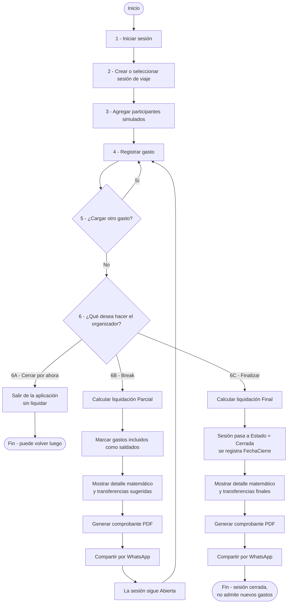

# Diagrama de flujo principal

Flujo típico de uso de la aplicación desde el login hasta el cierre de una sesión de viaje,
incluyendo las tres ramas del paso 6: **6A cerrar** (dejar de trabajar sin liquidar),
**6B break** (liquidación parcial) y **6C finalizar** (liquidación final).

## Notas del flujo

- El paso 4 (Registrar gasto) funciona con o sin conexión (RF06, RNF01); si no hay conexión el gasto
  se guarda en `IndexedDB` y se sincroniza más tarde.
- La rama **6B (break)** no cambia el `Estado` de la sesión: solo asigna una `Liquidacion` de tipo
  `Parcial` a los gastos pendientes y permite seguir cargando gastos nuevos.
- La rama **6C (finalizar)** requiere conexión (el cálculo de balance no corre offline) y deja la
  sesión en `Estado = Cerrada`, bloqueando la carga de gastos nuevos.
- Generar y compartir el comprobante (pasos posteriores a 6B/6C) cubren RF13 y RF14.
