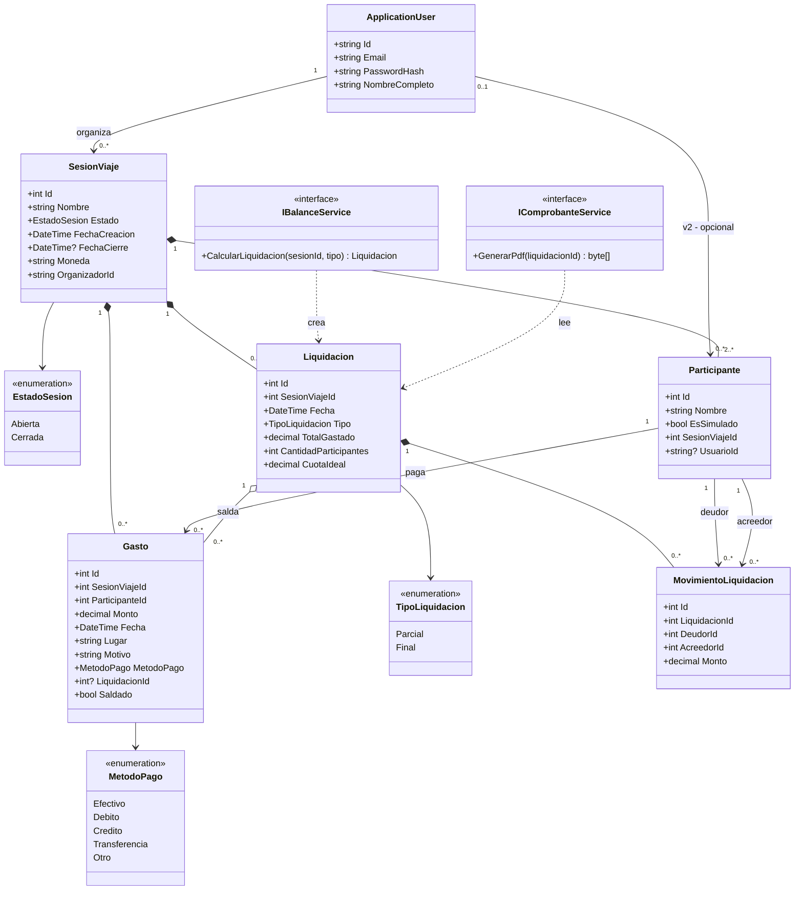

# Diagrama de clases

Modelo de la sección 3 del prompt maestro, ya con las cuatro correcciones aplicadas
(`decimal` para dinero, `PasswordHash` de Identity, `Liquidacion`/`MovimientoLiquidacion`
como entidades, `Balance`/`Comprobante` como servicios sin estado propio).

## Por qué `Balance` y `Comprobante` no son clases de dominio

En el diagrama original, `Balance` y `Comprobante` solo tenían métodos (`calcularBalance()`,
`generarPdf()`) y ningún dato propio: son **comportamiento**, no **estado**. Persistirlos
duplicaría información que ya vive en `Liquidacion` y sus `MovimientoLiquidacion`. Por eso se
implementan como servicios sin estado (`BalanceService`, `ComprobanteService`), inyectados por
DI, y no como entidades de EF Core.
