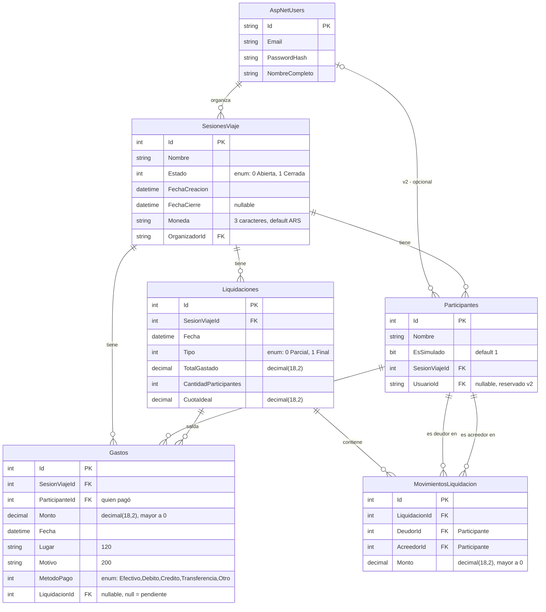

# Modelo entidad-relación

Tablas, claves primarias/foráneas y tipos tal como se generan con EF Core Code First
(convención `Id` como PK, sufijo `Id` como FK). `AspNetUsers` y el resto de las tablas de
Identity (`AspNetRoles`, `AspNetUserClaims`, etc.) las crea el framework; solo se documenta
la columna agregada.

## Comportamiento de borrado (`OnDelete`)

| Relación | Comportamiento | Motivo |
|---|---|---|
| `SesionViaje` → `Participante` | `Cascade` | Al borrar una sesión de viaje no tiene sentido dejar participantes huérfanos. |
| `SesionViaje` → `Gasto` | `Cascade` | Ídem: los gastos pertenecen exclusivamente a una sesión. |
| `SesionViaje` → `Liquidacion` | `Cascade` | Ídem. |
| `MovimientoLiquidacion` → `Participante` (Deudor) | `Restrict` | Evita el error de SQL Server por múltiples caminos de cascada (un `Participante` puede ser deudor y acreedor a la vez). |
| `MovimientoLiquidacion` → `Participante` (Acreedor) | `Restrict` | Ídem. |

## Índices

- `Gasto.SesionViajeId` (consultas frecuentes: "gastos de esta sesión").
- `Gasto.LiquidacionId` (consultas frecuentes: "gastos pendientes vs. saldados").
