# Estructura de Desglose de Trabajo (EDT / WBS)

Cubre las fases 1 a 7 definidas en la sección 8 del prompt maestro (la Fase 0 es este
mismo conjunto de documentos). Numeración jerárquica `1 / 1.1 / 1.1.1`.

```mermaid
graph TD
    P1["1. Solución y esqueleto"]
    P1 --> P11["1.1 Crear solución y proyecto MVC (Individual Accounts)"]
    P1 --> P12["1.2 Crear estructura de carpetas"]
    P1 --> P13["1.3 Configurar cadena de conexión"]
    P1 --> P14["1.4 README inicial"]
    P1 --> P15["1.5 Verificar compilación y arranque"]

    P2["2. Modelo de datos"]
    P2 --> P21["2.1 Entidades y enums"]
    P2 --> P22["2.2 AppDbContext + Fluent API"]
    P2 --> P23["2.3 Migración inicial"]
    P2 --> P24["2.4 Update-Database"]
    P2 --> P25["2.5 SeedData de ejemplo"]

    P3["3. CRUD scaffoldeado"]
    P3 --> P31["3.1 Scaffolding de SesionViaje"]
    P3 --> P32["3.2 Scaffolding de Participante"]
    P3 --> P33["3.3 Scaffolding de Gasto"]
    P3 --> P34["3.4 Filtrar por organizador logueado"]
    P3 --> P35["3.5 Bloquear carga en sesiones Cerradas"]
    P3 --> P36["3.6 Adaptar vistas al criterio de diseño"]

    P4["4. Motor de cálculo"]
    P4 --> P41["4.1 IBalanceService / BalanceService"]
    P4 --> P42["4.2 Endpoints de break y cierre"]
    P4 --> P43["4.3 Vista de detalle matemático"]
    P4 --> P44["4.4 Proyecto de tests xUnit"]
    P4 --> P45["4.5 Casos de prueba obligatorios"]

    P5["5. Comprobantes"]
    P5 --> P51["5.1 ComprobanteService con QuestPDF"]
    P5 --> P52["5.2 Botón de descarga de PDF"]
    P5 --> P53["5.3 Enlace wa.me"]
    P5 --> P54["5.4 navigator.share()"]

    P6["6. PWA / offline"]
    P6 --> P61["6.1 manifest.json + iconos"]
    P6 --> P62["6.2 Service worker (sw.js)"]
    P6 --> P63["6.3 IndexedDB + cola de sincronización"]
    P6 --> P64["6.4 Banner de pendientes"]
    P6 --> P65["6.5 Endpoint POST /api/sync/gastos"]

    P7["7. Cierre"]
    P7 --> P71["7.1 site.css final"]
    P7 --> P72["7.2 Revisión de accesibilidad y responsive"]
    P7 --> P73["7.3 README completo"]
    P7 --> P74["7.4 Manual de usuario breve"]
```

